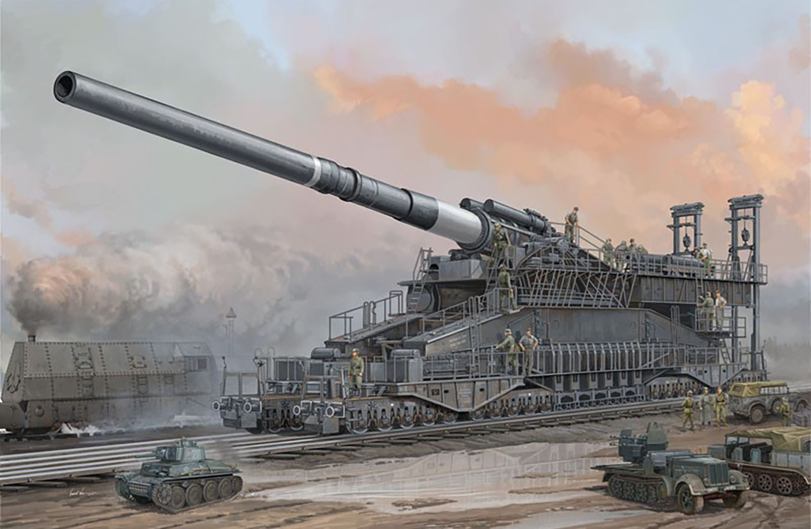

<!DOCTYPE html>
<html>
<head>
<link rel="stylesheet" href="zadanie.css">
</head>
<body>

<h3>Stacja</h3>

  Stoi na stacji lokomotywa,
Ciężka, ogromna i pot z niej spływa:
Tłusta oliwa.
Stoi i sapie, dyszy i dmucha,
Żar z rozgrzanego jej brzucha bucha:
Buch - jak gorąco!
Uch - jak gorąco!
Puff - jak gorąco!
Uff - jak gorąco!
Już ledwo sapie, już ledwo zipie,
  A jeszcze palacz węgiel w nią sypie.

<h3><a href="https://pl.wikipedia.org/wiki/Lokomotywa" target="_blank">Lokomotywa</a></h3>

  Wagony do niej podoczepiali
Wielkie i ciężkie, z żelaza, stali,
I pełno ludzi w każdym wagonie,
A w jednym krowy, a w drugim konie,
A w trzecim siedzą same grubasy,
Siedzą i jedzą tłuste kiełbasy,
A czwarty wagon pełen bananów,
A w piątym stoi sześć fortepianów,
W szóstym armata - o! jaka wielka!
Pod każdym kołem żelazna belka!
W siódmym dębowe stoły i szafy,
W ósmym słoń, niedźwiedź i dwie żyrafy,
W dziewiątym - same tuczone świnie,
W dziesiątym - kufry, paki i skrzynie.
A tych wagonów jest ze czterdzieści,
Sam nie wiem, co się w nich jeszcze mieści.
Lecz choćby przyszło tysiąc atletów
I każdy zjadłby tysiąc kotletów,
I każdy nie wiem jak się wytężał,
To nie udźwigną, taki to ciężar.

<h3>Dźwięki</h3>

Nagle - gwizd!
Nagle - świst!
Para - buch!
  Koła - w ruch!

<h3>Ruch</h3>

  Najpierw - powoli - jak żółw – ociężale,
Ruszyła - maszyna - po szynach - ospale,
Szarpnęła wagony i ciągnie z mozołem,
I kręci się, kręci się koło za kołem,
I biegu przyspiesza, i gna coraz prędzej,
I dudni, i stuka, łomoce i pędzi,
A dokąd? A dokąd? A dokąd? Na wprost!
Po torze, po torze, po torze, przez most,
Przez góry, przez tunel, przez pola, przez las,
I spieszy się, spieszy, by zdążyć na czas,
Do taktu turkoce i puka, i stuka to:
Tak to to, tak to to , tak to to, tak to to.
Gładko tak, lekko tak toczy się w dal,
Jak gdyby to była piłeczka, nie stal,
Nie ciężka maszyna, zziajana, zdyszana,
  Lecz fraszka, igraszka, zabawka blaszana.

<h3><a href="https://pl.wikipedia.org/wiki/Silnik_parowy" target="_blank">Dokąd zmierzamy i jak to działa?</a></h3>

  A skądże to, jakże to, czemu tak gna?
A co to to, co to to, kto to tak pcha,
Że pędzi, że wali, że bucha buch, buch?
To para gorąca wprawiła to w ruch,
To para, co z kotła rurami do tłoków,
A tłoki kołami ruszają z dwóch boków
I gnają, i pchają, i pociąg się toczy,
Bo para te tłoki wciąż tłoczy i tłoczy,
I koła turkocą, i puka, i stuka to:
  Tak to to, tak to to, tak to to, tak to to!…

<table>
  <tr><td>Numer wagonu</td><td>Zawartość</td></tr>
  <tr><td>Wagon 1</td><td>krowy</td></tr>
  <tr><td>Wagon 2</td><td>konie</td></tr>
  <tr><td>Wagon 3</td><td>grubasy</td></tr>
  <tr><td>Wagon 4</td><td>banany</td></tr>
  <tr><td>Wagon 5</td><td>fortepiany</td></tr>
  <tr><td>Wagon 6</td><td>wielka armata</td></tr>
  <tr><td>Wagon 7</td><td>stoły i szafy</td></tr>
  <tr><td>Wagon 8</td><td>niedźwiedź i dwie żyrafy</td></tr>
  <tr><td>Wagon 9</td><td>tuczone świnie</td></tr>
  <tr><td>Wagon 10</td><td>kufry paki i skrzynie</td></tr>
</table>

</body>
</html>
